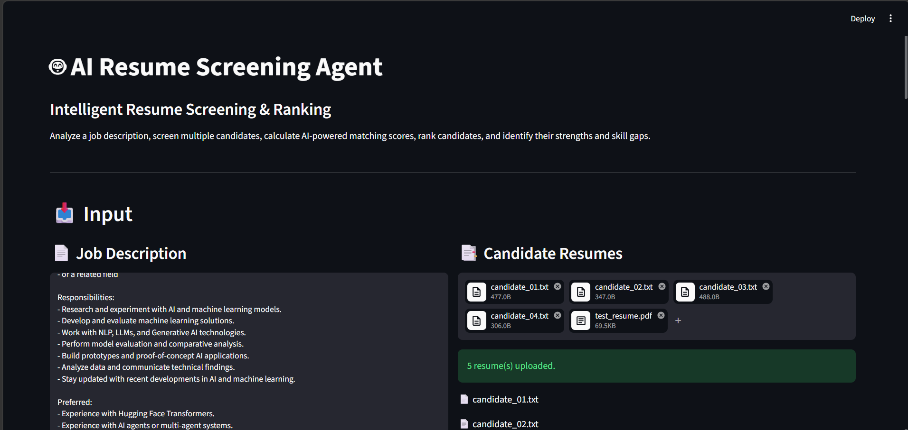
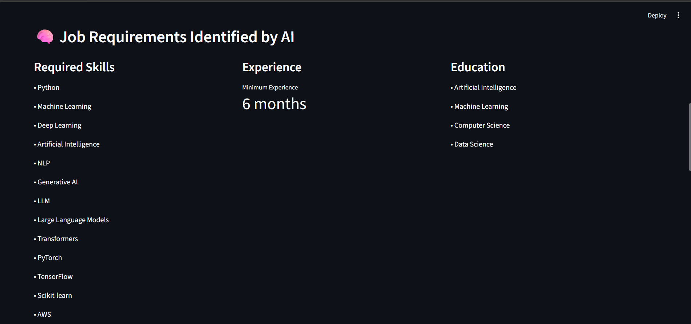
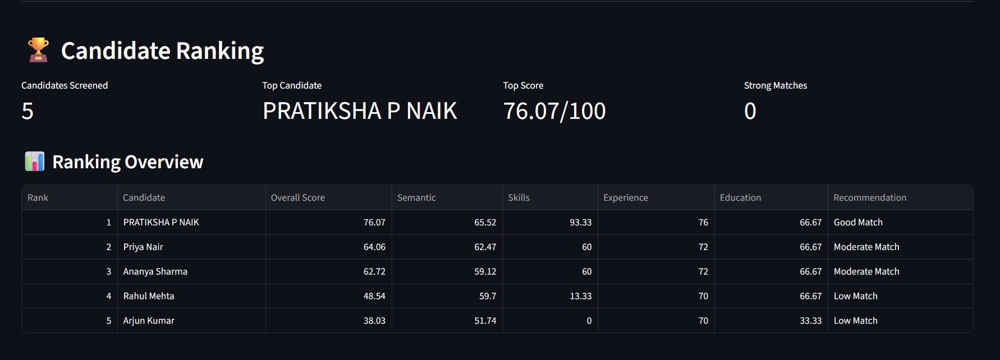
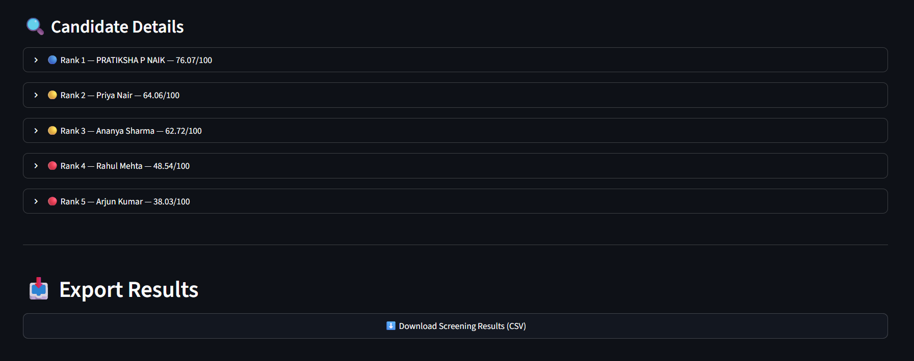
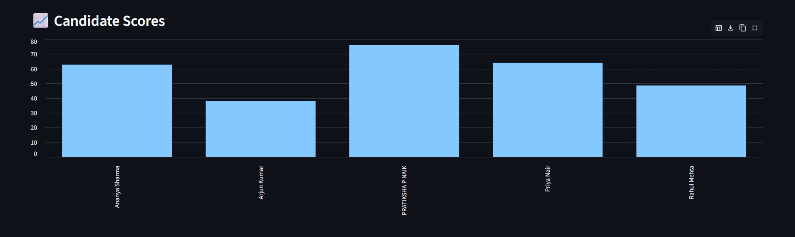

# 🤖 AI Resume Screening Agent

> An AI-powered, explainable resume screening system that analyzes job descriptions, evaluates multiple resumes, ranks candidates, identifies strengths and skill gaps, and generates structured screening recommendations.

---

## 🚀 Project Overview

Recruiters often need to review hundreds of resumes for a single job opening.

Traditional resume screening can be:

- Time-consuming
- Repetitive
- Difficult to scale
- Inconsistent between candidates
- Too dependent on exact keyword matching

This project addresses the problem by building an **AI-powered Resume Screening Agent** that automatically performs the first stage of candidate evaluation.

The system takes a **Job Description (JD)** and multiple resumes as input and produces an explainable candidate ranking.

Instead of relying only on keywords, the system combines:

- Job requirement extraction
- Resume information extraction
- Semantic similarity
- Skill matching
- Experience duration
- Experience relevance
- Education matching
- Candidate scoring
- Candidate ranking
- Strength and skill-gap analysis
- Screening recommendations

---

# 🎯 Problem Statement

Given a job description and a collection of candidate resumes, automatically identify the candidates who are most relevant to the role.

The system should answer:

> **"Which candidates are the strongest matches for this job, and why?"**

The output should not be limited to a single score.

For every candidate, the system provides:

- Overall score
- Semantic relevance
- Skill match
- Experience score
- Education score
- Strengths
- Skill gaps
- Recommendation
- Final ranking

---

# 💡 Proposed Solution

The system follows an end-to-end screening pipeline:

```text
                 JOB DESCRIPTION
                        │
                        ▼
              ┌──────────────────┐
              │   JD Analyzer     │
              └────────┬─────────┘
                       │
             Requirements Extracted
                       │
          ┌────────────┴────────────┐
          │                         │
          ▼                         ▼
     Required Skills          Experience
          │
          ▼
   Education Requirements
                       │
                       ▼
             ┌──────────────────┐
             │ Resume Uploads   │
             └────────┬─────────┘
                      │
            ┌─────────┼─────────┐
            ▼         ▼         ▼
           PDF       DOCX      TXT
            │         │         │
            └─────────┼─────────┘
                      ▼
             ┌──────────────────┐
             │ Resume Parser    │
             └────────┬─────────┘
                      ▼
             ┌──────────────────┐
             │ Information      │
             │ Extractor        │
             └────────┬─────────┘
                      │
        ┌─────────────┼─────────────┐
        ▼             ▼             ▼
      Skills      Experience     Education
        │             │             │
        └─────────────┼─────────────┘
                      ▼
             Semantic Matching
                      │
                      ▼
              Candidate Scoring
                      │
                      ▼
              Candidate Ranking
                      │
                      ▼
            Screening Reasoning
                      │
                      ▼
              Streamlit Dashboard
                      │
                      ▼
                  CSV Export
```

---

# 🧩 Agent Components

The system is organized into modular components, with each component responsible for a specific stage of the screening workflow.

### 1. Job Description Analyzer

**File:** `agent/jd_analyzer.py`

Analyzes the job description and identifies:

- Required skills
- Minimum experience
- Education requirements

### 2. Resume Parser

**File:** `agent/parser.py`

Converts uploaded resumes into processable text.

Supported formats:

- PDF
- DOCX
- TXT

### 3. Resume Information Extractor

**File:** `agent/extractor.py`

Extracts structured candidate information:

- Name
- Skills
- Education
- Experience
- Projects
- Research

The extractor also performs conservative NLP inference using multiple NLP-related indicators such as LLMs, Transformers, RAG, NLTK, spaCy, BERT, text classification, question answering, and text summarization.

### 4. Semantic Matching Engine

**File:** `agent/embeddings.py`

Calculates semantic similarity between:

```text
Job Description ↔ Candidate Resume
```

This allows the system to evaluate conceptual relevance instead of depending only on exact keyword matches.

### 5. Candidate Scorer

**File:** `agent/scorer.py`

Combines:

- Semantic similarity
- Skills
- Experience
- Education

### 6. Candidate Ranker

**File:** `agent/ranker.py`

Sorts candidates according to their overall screening score and assigns a final rank.

### 7. Candidate Reasoner

**File:** `agent/reasoning.py`

Generates:

- Candidate strengths
- Skill gaps
- Screening recommendation

### 8. Screening Pipeline

**File:** `agent/pipeline.py`

Acts as the main orchestration layer:

```text
JD Analyzer
     ↓
Resume Parser
     ↓
Information Extractor
     ↓
Semantic Matcher
     ↓
Candidate Scorer
     ↓
Candidate Ranker
     ↓
Candidate Reasoner
     ↓
Final Screening Results
```

---

# 🧠 Why This Is More Than Keyword Matching

A traditional resume screening system might simply check whether a keyword exists:

```text
"Python" found → Match
"Python" not found → No Match
```

This project combines multiple signals:

```text
                 Candidate
                     │
        ┌────────────┼────────────┐
        ▼            ▼            ▼
    Semantic       Skills      Experience
    Similarity      Match       Relevance
        │            │            │
        └────────────┼────────────┘
                     ▼
                 Education
                     │
                     ▼
               Overall Score
                     │
                     ▼
                  Ranking
```

This provides a more structured evaluation of candidate-job fit.

---

# 📊 Candidate Scoring

The overall candidate score is calculated using four weighted components:

| Component | Weight |
|---|---:|
| Semantic Similarity | 40% |
| Skills | 30% |
| Experience | 20% |
| Education | 10% |

### Formula

```text
Overall Score =
    (Semantic Score × 0.40)
  + (Skills Score × 0.30)
  + (Experience Score × 0.20)
  + (Education Score × 0.10)
```

The final score is represented on a scale of **0–100**.

---

# ⏱️ Experience Evaluation

Experience is evaluated using:

1. Experience duration
2. Relevance of the experience to the job requirements

For example:

```text
Candidate A:
AI Research Intern — 8 months

Candidate B:
Web Developer — 1 year
```

For an AI research position, the first candidate may receive a stronger experience relevance score even though the second candidate has more total months of experience.

This helps distinguish general experience from relevant experience.

---

# 🛠️ Skill Matching

The system compares candidate skills against the required skills extracted from the job description.

Example:

```text
Required Skills:
Python
Machine Learning
Deep Learning
NLP

Candidate Skills:
Python
Machine Learning
Deep Learning
NLP
```

The candidate receives:

```text
Skills Score = 100%
```

If only two of the four required skills are detected:

```text
Skills Score = 50%
```

Missing skills are reported as **skill gaps**.

---

# 🎓 Education Matching

The education component evaluates whether the candidate's educational background is relevant to the job requirements.

Example education keywords include:

- Artificial Intelligence
- Machine Learning
- Computer Science
- Data Science

Education contributes **10%** to the overall candidate score.

---

# 🔍 Explainable Screening

The system does not provide only a numerical ranking.

For every candidate, it provides an explanation.

### Strengths

Skills identified in the candidate profile that match the job requirements.

Example:

```text
✓ Python
✓ Machine Learning
✓ Deep Learning
✓ Generative AI
✓ NLP
```

### Skill Gaps

Required skills that were not identified in the candidate profile.

Example:

```text
⚠ NLP
⚠ Transformers
```

### Recommendation

Candidates are categorized as:

- Good Match
- Moderate Match
- Low Match

The recommendation is intended to support human review rather than replace the final hiring decision.

---

# 🖥️ Streamlit Application

The project includes a Streamlit-based interface that allows users to:

1. Enter a Job Description
2. Upload multiple candidate resumes
3. Run the screening pipeline
4. View extracted job requirements
5. View candidate rankings
6. Inspect individual candidate scores
7. Review strengths and skill gaps
8. Export screening results

---

# 🔄 End-to-End Workflow

```text
Job Description
       ↓
Requirement Extraction
       ↓
Resume Upload
       ↓
Document Parsing
       ↓
Candidate Information Extraction
       ↓
Semantic Similarity
       ↓
Skill Matching
       ↓
Experience Evaluation
       ↓
Education Evaluation
       ↓
Overall Score
       ↓
Candidate Ranking
       ↓
Strengths & Skill Gaps
       ↓
Recommendation
       ↓
Streamlit Dashboard
       ↓
CSV Export
```

---

# 📸 Application Screenshots

## 1. Resume Screening Interface



The application accepts a job description and multiple candidate resumes.

## 2. AI Job Requirement Analysis



The system extracts required skills, minimum experience, and education requirements from the job description.

## 3. Candidate Ranking



Candidates are ranked according to their calculated overall screening score.

## 4. Candidate Details



The candidate detail section displays individual scores, strengths, skill gaps, and recommendations.

## 5. Score Visualization



The dashboard provides a visual comparison of candidate scores.

---

# 🛠️ Technology Stack

| Category | Technology |
|---|---|
| Programming Language | Python |
| User Interface | Streamlit |
| Semantic Matching | Sentence Transformers |
| NLP | Hugging Face / Regex-based extraction |
| Document Processing | PDF, DOCX, TXT |
| Data Processing | Pandas, NumPy |
| Testing | Pytest |
| Version Control | Git, GitHub |
| Development Environment | VS Code |

---

# 📁 Project Structure

```text
resume-screening-agent/
│
├── agent/
│   ├── __init__.py
│   ├── embeddings.py
│   ├── extractor.py
│   ├── jd_analyzer.py
│   ├── parser.py
│   ├── pipeline.py
│   ├── ranker.py
│   ├── reasoning.py
│   └── scorer.py
│
├── data/
│   ├── job_descriptions/
│   └── resumes/
│
├── outputs/
│
├── screenshots/
│   ├── input.png
│   ├── job-requirements.png
│   ├── ranking.png
│   ├── candidate-details.png
│   └── scores.png
│
├── tests/
│   ├── test_embeddings.py
│   ├── test_experience.py
│   ├── test_extractor.py
│   ├── test_jd_analyzer.py
│   ├── test_output.py
│   ├── test_parser.py
│   ├── test_pdf_extractor.py
│   ├── test_pdf_parser.py
│   ├── test_pipeline.py
│   ├── test_ranker.py
│   ├── test_reasoning.py
│   ├── test_scorer.py
│   └── test_skills.py
│
├── .gitignore
├── main.py
├── requirements.txt
└── README.md
```

---

# ⚙️ Installation

## 1. Clone the repository

```bash
git clone https://github.com/Pratiksha249/Ai-resume-screening-agent.git
```

## 2. Navigate to the project

```bash
cd Ai-resume-screening-agent
```

## 3. Create a virtual environment

```bash
python -m venv venv
```

## 4. Activate the virtual environment

### Windows PowerShell

```powershell
venv\Scripts\activate
```

### macOS / Linux

```bash
source venv/bin/activate
```

## 5. Install dependencies

```bash
pip install -r requirements.txt
```

---

# ▶️ Running the Application

Start the Streamlit application:

```bash
streamlit run main.py
```

The application will open in the browser.

---

# 🧪 Testing

The project uses **Pytest** for automated testing.

Run:

```bash
python -m pytest -v
```

The core automated test suite validates:

- Resume text extraction
- Candidate name extraction
- Skill extraction
- NLP inference
- Experience duration calculation
- Experience scoring
- Skill scoring
- Education scoring
- Overall score calculation

### Current Core Test Result

```text
10 passed
```

---

# 📤 Output

The system generates structured screening results containing:

```text
Candidate
Overall Score
Semantic Score
Skills Score
Experience Score
Education Score
Recommendation
Strengths
Skill Gaps
```

Results can also be exported as CSV for further analysis.

---

# 🧪 Testing Strategy

The project uses component-level testing to verify the main stages of the screening pipeline.

```text
Parser Tests
     ↓
Extractor Tests
     ↓
Skill Tests
     ↓
Experience Tests
     ↓
Scoring Tests
     ↓
Pipeline Tests
```

This helps identify errors at the component level before testing the complete screening workflow.

---

# 📈 What This Project Demonstrates

This project demonstrates an end-to-end application of AI and NLP techniques to a practical recruitment workflow.

Technical concepts demonstrated include:

- Natural Language Processing
- Semantic embeddings
- Similarity measurement
- Information extraction
- Rule-based reasoning
- Multi-factor scoring
- Candidate ranking
- Explainable AI
- Document processing
- Streamlit application development
- Automated testing
- Modular software architecture

---

# ⚠️ Limitations

### Resume Parsing

Complex layouts, tables, graphics, or unusual PDF structures can affect text extraction.

### Experience Extraction

Experience duration is estimated from textual patterns and may not perfectly reconstruct complex employment timelines.

### Skill Extraction

The current skill extractor uses predefined patterns and conservative inference. New or highly specialized skills may require additional patterns.

### Education Matching

Education relevance currently relies primarily on keyword-based matching.

### Semantic Similarity

Semantic similarity depends on the selected embedding model and does not guarantee that two semantically similar resumes represent equivalent professional experience.

### Human Oversight

The system is intended as a screening support tool and should not independently make final employment decisions.

---

# 🔐 Responsible AI Considerations

Automated resume screening can influence employment opportunities.

Potential risks include:

- Bias in recruitment data
- False positives
- False negatives
- Missing information in resumes
- Over-reliance on automated scores

Therefore, the system should be used as a **decision-support tool**, with final decisions remaining under appropriate human review.

---

# 🚀 Future Improvements

### 1. LLM-Based Resume Extraction

Use an LLM to convert unstructured resumes into a standardized candidate schema.

### 2. Advanced Skill Ontology

Map related skills and aliases.

```text
NLP
├── NLTK
├── spaCy
├── BERT
├── Transformers
└── Text Classification
```

### 3. Improved Experience Timeline

Extract:

```text
Company
Role
Start Date
End Date
Duration
Technology
Relevance
```

### 4. Recruiter Feedback

Allow recruiters to provide feedback on candidate rankings.

### 5. Database Integration

Store:

- Candidates
- Job descriptions
- Screening results
- Historical rankings

### 6. Cloud Deployment

Deploy the system for remote recruiter access.

### 7. Human-in-the-Loop Workflow

```text
AI Ranking
     ↓
Recruiter Review
     ↓
Shortlist
     ↓
Interview
```

### 8. Fairness Evaluation

Add fairness and bias monitoring for automated screening results.

---

# 🎯 Success Criteria

The implementation satisfies the following core requirements:

```text
✓ Accept a Job Description
✓ Process multiple resumes
✓ Support PDF, DOCX and TXT
✓ Extract candidate information
✓ Identify job requirements
✓ Calculate semantic similarity
✓ Compare required skills
✓ Evaluate experience
✓ Evaluate education
✓ Calculate overall scores
✓ Rank candidates
✓ Generate strengths
✓ Generate skill gaps
✓ Generate recommendations
✓ Display results through Streamlit
✓ Export results
✓ Run automated tests
```

---

# 💭 Design Decisions

## Why Semantic Similarity?

Keyword matching can miss candidates who describe similar experience using different terminology.

Semantic embeddings allow the system to compare the meaning of the job description and resume.

## Why Multiple Scoring Components?

A candidate may have strong semantic similarity but lack important technical skills.

Similarly, a candidate may have several years of experience but in an unrelated domain.

Combining:

```text
Semantic Similarity
        +
Skills
        +
Experience
        +
Education
```

provides a more balanced candidate evaluation.

## Why Explainable Results?

Recruiters need to understand why a candidate received a particular ranking.

Therefore, the system exposes:

```text
Score
  +
Strengths
  +
Skill Gaps
  +
Recommendation
```

rather than hiding the decision behind a single score.

---

# 🔒 Data & Repository Safety

For public repositories, candidate resumes should be anonymized.

The repository should not contain:

- Real candidate personal information
- Private phone numbers
- Private email addresses
- API keys
- Access tokens
- `.env` files
- Virtual environment files

The `.gitignore` file is used to prevent common environment and cache files from being committed.

---

# 👩‍💻 Author

## Pratiksha P Naik

**MSc Artificial Intelligence and Machine Learning**

Areas of interest:

- Artificial Intelligence
- Machine Learning
- Generative AI
- NLP
- Agentic AI

GitHub:

https://github.com/Pratiksha249

---

# ⭐ Project Highlights

```text
🤖 AI-powered resume screening
📄 PDF / DOCX / TXT support
🧠 Semantic resume-job matching
🔎 Skill matching
⏱️ Experience relevance scoring
🎓 Education matching
🏆 Candidate ranking
💡 Explainable strengths and skill gaps
📊 Streamlit dashboard
📥 CSV export
🧪 Automated testing
🧩 Modular architecture
```

---

# 📜 Disclaimer

This project is an AI-assisted resume screening prototype developed for educational and demonstration purposes.

The generated rankings and recommendations should be treated as decision-support signals and should not be used as the sole basis for employment decisions.
